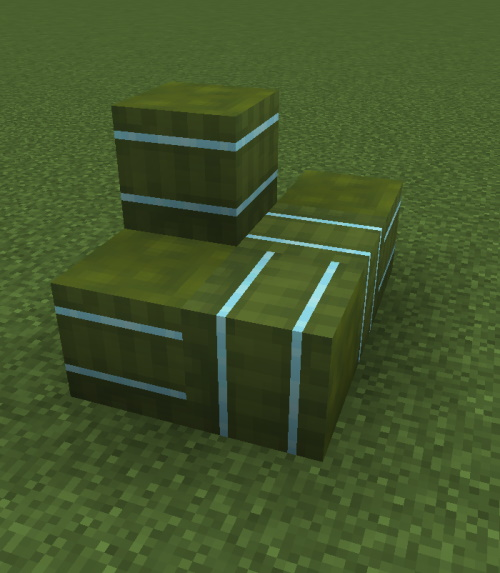
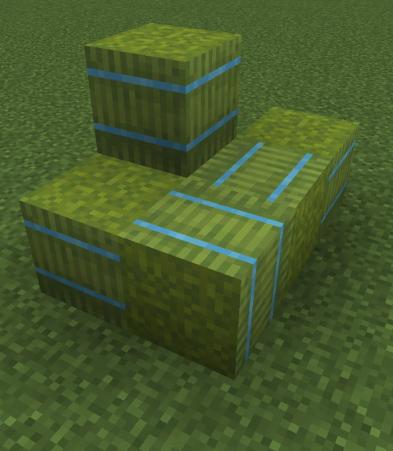
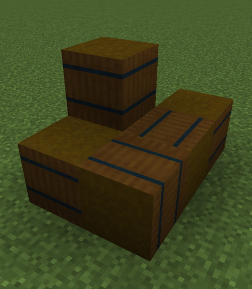
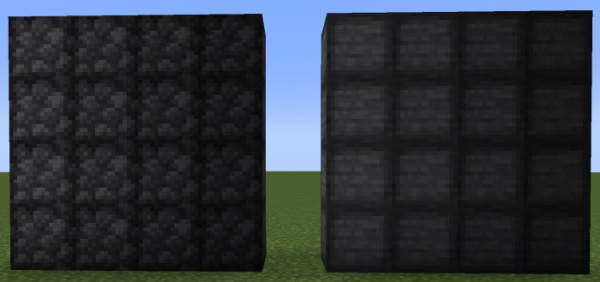
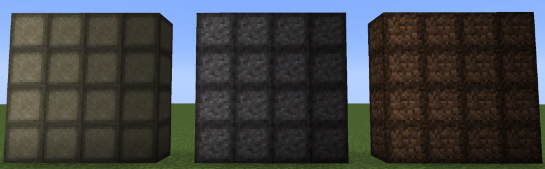

# 

  

## Introduction

This mod contains various items intended to go with the [World of Pannotia modpack](https://www.curseforge.com/minecraft/modpacks/world-of-pannotia). It also serves as a place for me to learn the basics of modding.

## Features

The mod currently features a number of blocks useful for decoration as well as storing large quantities of common materials.

* Bamboo, cane, and stick bundles: made with 9 of their respective materials, these blocks can be placed in much the same way as hay bales.
* Compressed blocks (up to 4x): made with 9 of their respective materials (or 9 of the previous compression level), these blocks are useful for storing massive amounts of common blocks.
  * Cobblestone
  * Dirt
  * Gravel
  * Sand
  * Stone

### Screenshots

## Issues & Suggestions

Please use the [GitHub issue tracker](https://github.com/worldofpannotia/pannotias-parcels/issues) to report any bugs you find. If you have a suggestion for a feature that might fit with the mod (or the [World of Pannotia modpack](https://www.curseforge.com/minecraft/modpacks/world-of-pannotia)), or think a something should be tweaked or removed to improve gameplay, submit those as well!

## Credits

Obviously this mod would not be possible if not for the people at Mojang making an awesome game. In addition, many
thanks go to the developers of the Fabric mod loader.

[Pack icon downloaded from OpenGameArt.org.](https://opengameart.org/content/bag-icon)  
[Parcel image downloaded from pixabay.com.](https://pixabay.com/vectors/parcel-package-packaging-box-575623/)

## License

This mod is released under the MIT license. [The full text of the license can be found here.](./LICENSE)
